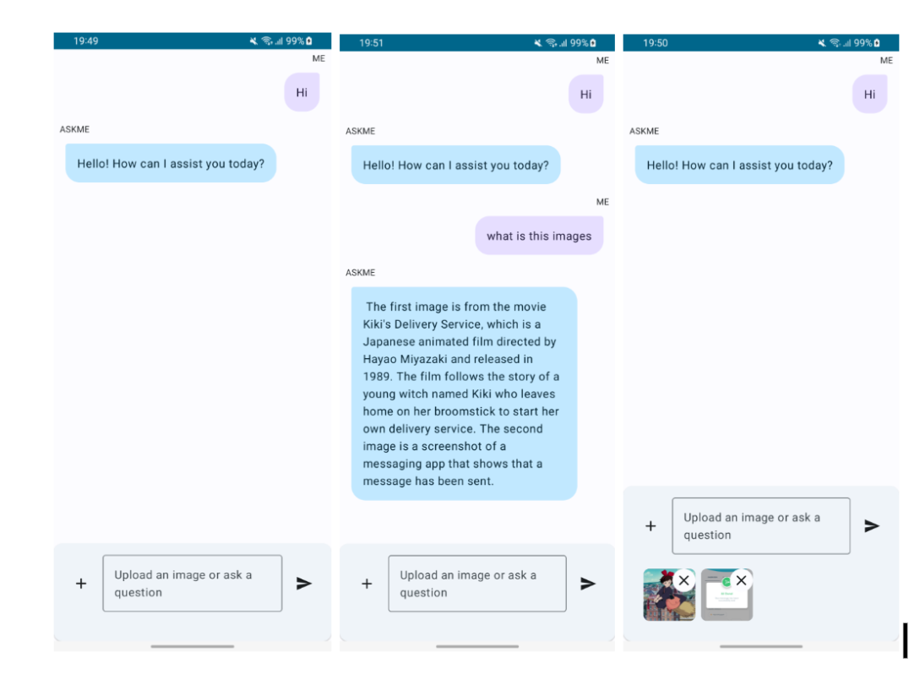

# Ask Me


Brief introduction and description of your Android app.

## Table of Contents

- [Introduction](#introduction)
- [Features](#features)
- [Tech Stack](#tech-stack)
- [Getting Started](#getting-started)
- [Screenshots](#screenshots)

## Introduction

Welcome to Ask Me! This Android app leverages the power of the Gemini generative AI model to provide answers to user queries. Users can also upload images and ask questions based on those images.

## Features

- Ask questions and get answers using Gemini generative AI.
- Upload images and ask questions based on the content of the images.

## Tech Stack

- **Gemini Generative AI Model**: [Link to Gemini](#)
- **Jetpack Compose**: [Link to Jetpack Compose](#)
- **MVVM Architecture**: [Link to MVVM Architecture](#)
- **Hilt Dependency Injection**: [Link to Hilt](#)

## Getting Started

Follow these steps to get a copy of the project up and running on your local machine for development and testing purposes.

```bash
# Clone the repository
git clone https://github.com/samir-sayyed/ask-me.git

# Add the following in local.properties file
api_key = <YOUR_API_KEY>

# Build and run the project
```

## Screenshots




